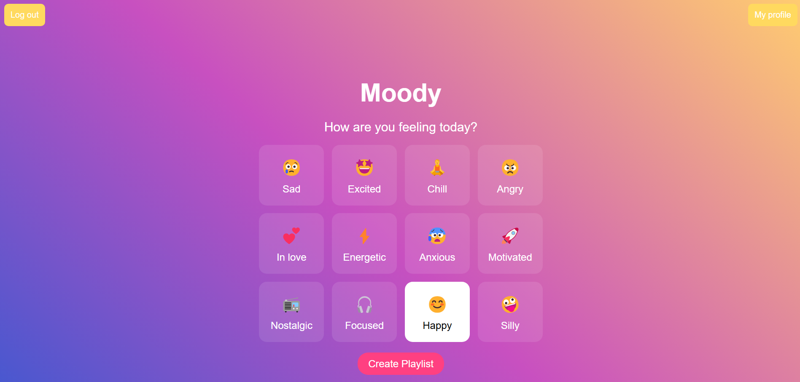
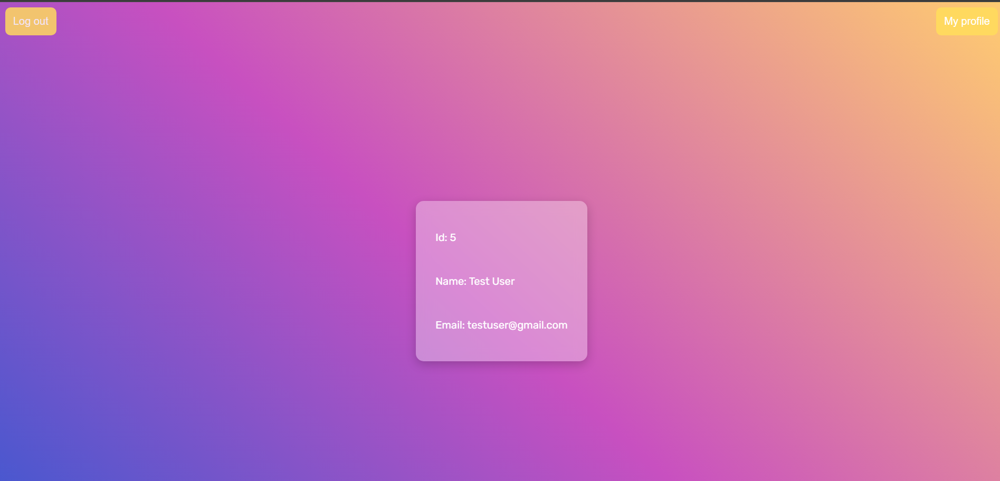

# 🎵 Moody Frontend - Mood-Based Playlist Generator

Moody is a frontend Angular application that generates music playlists based on your current mood.  

> ⚙️ This frontend is designed to work **in tandem with the [Moody Backend](https://github.com/teodorat63/Moody)**, which handles user authentication, mood tracking, and playlist generation.

## 🛠️ Tech Stack

- **Frontend:** Angular

## 📸 Preview

### 📊 Dashboard 

### 🎧 Playlist Page

### 🔐 Login Page

### 👤 Profile Page

## 🚀 Features

- 🧠 Mood-based playlist generation
- 🎧 Auto-curated tracks from YouTube
- 👤 Profile page to manage your details
- 🌈 Bright, intuitive UI
- 🔄 Ability to switch moods and refresh playlists anytime

